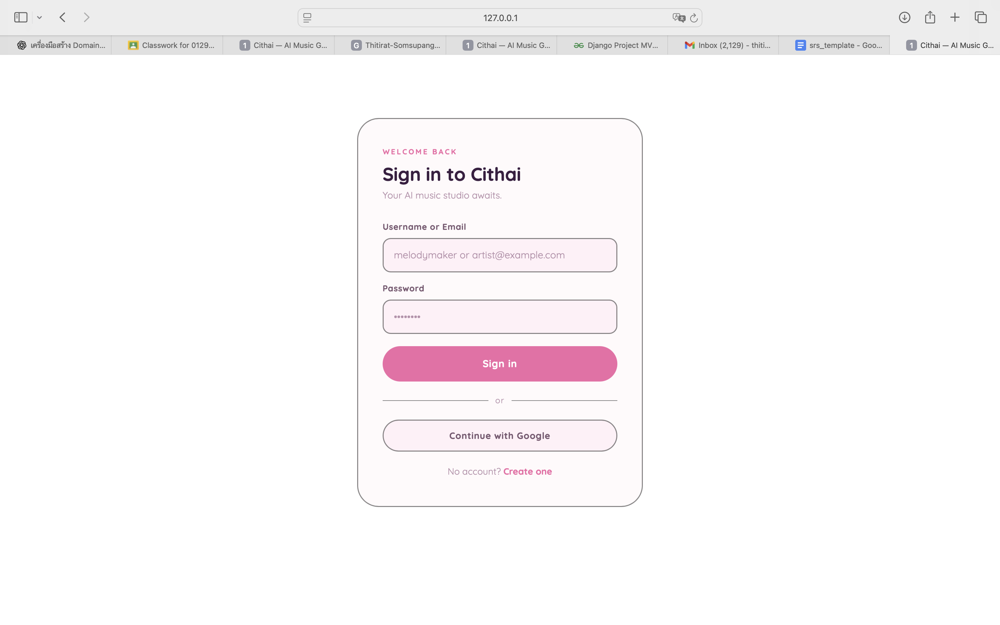
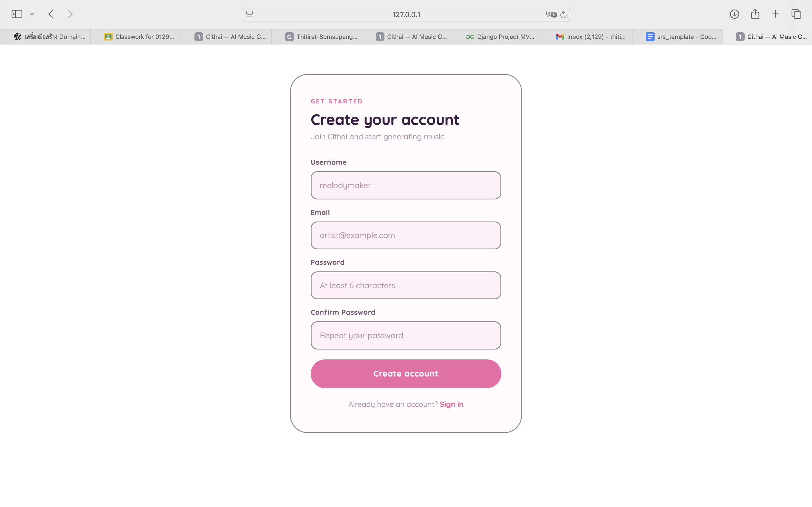
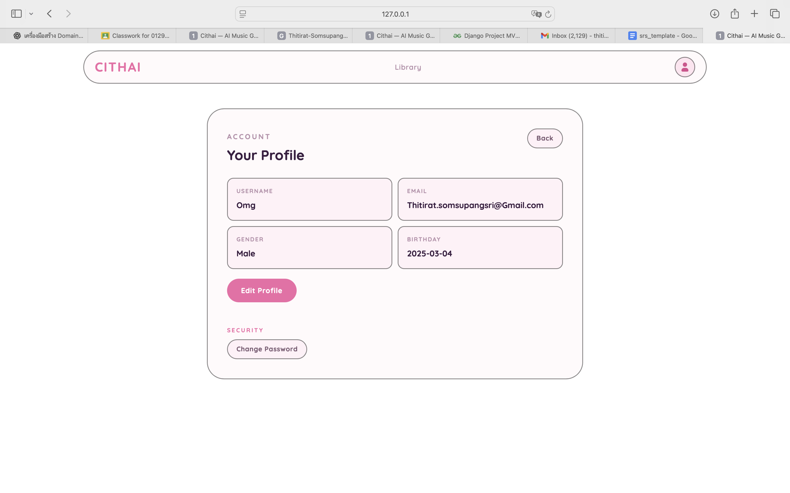
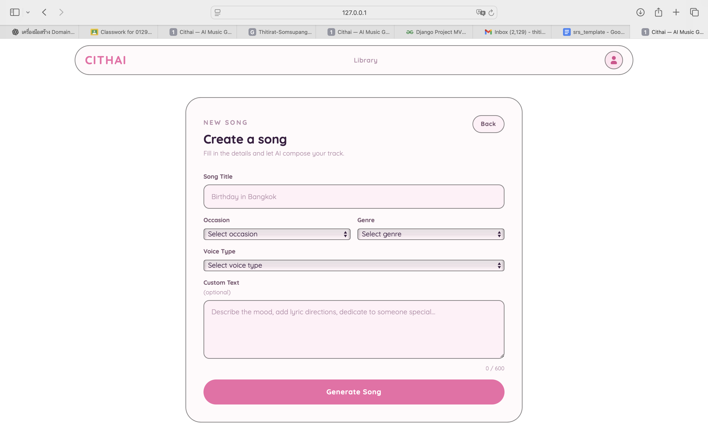
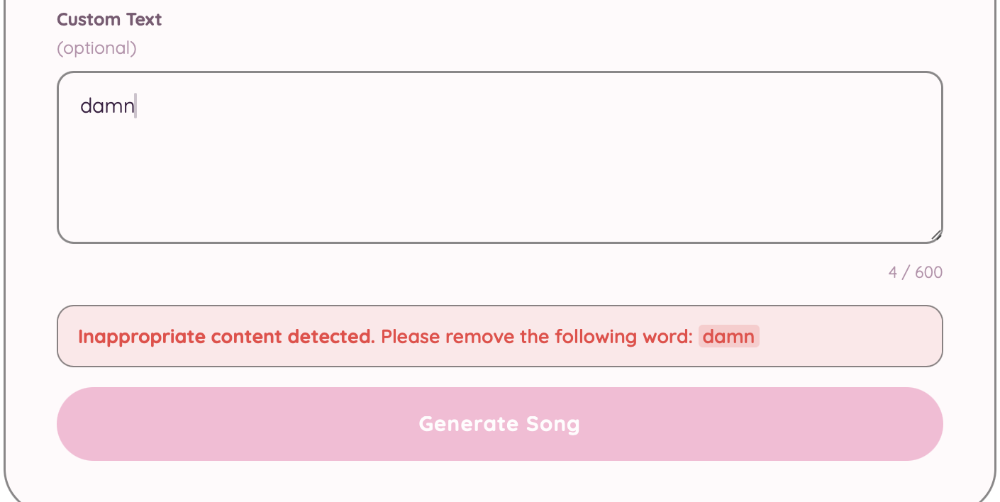
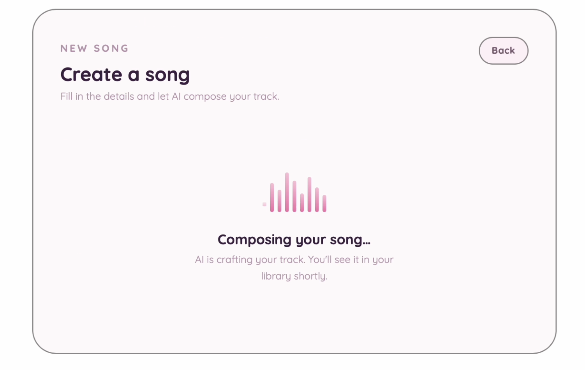
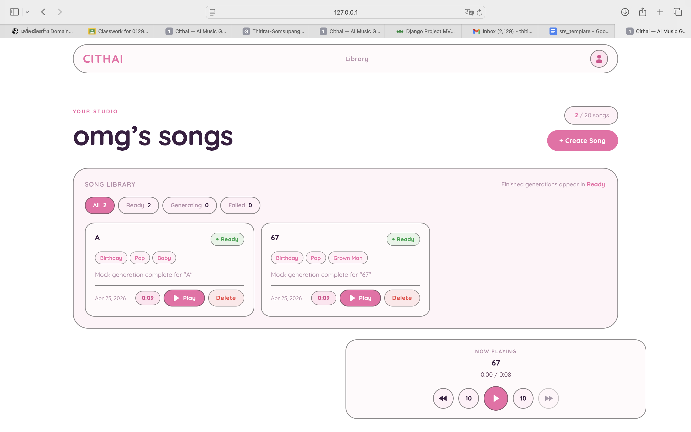
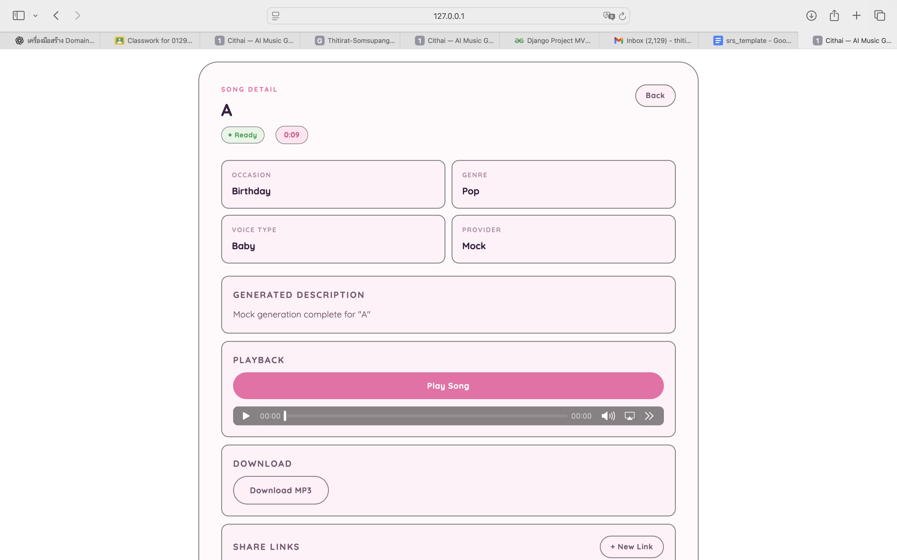
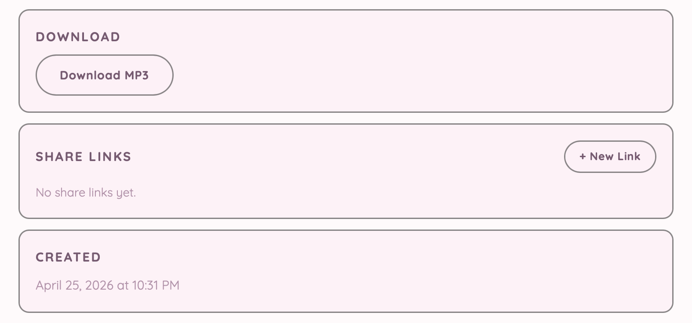

# Feature Demo

This document shows the implemented features with demo screenshots.

## 1. User Authentication and Account Access

Users can sign in to access the application and create a new account to start using the system.

### Sign In

### Create User Account

## 2. User Profile Management

Users can view and update their profile information, including personal details used by the system.

## 3. Song Creation and Preference Setup

Users can create a song by entering the title and selecting song preferences such as occasion, genre, voice type, and custom text.

## 4. Prompt Safety and Content Moderation

The song creation flow includes prompt validation and moderation before the generation request is accepted.

## 5. AI Song Generation and Progress Tracking

After submission, the system creates the song and tracks its status through the generation lifecycle until it becomes ready.

## 6. Personal Song Library and Playback

Users can access their personal song library, browse generated songs, and play them from the library interface.

## 7. Song Description, Download, and Sharing

Users can open the song detail view to see the generated description and access actions related to the song.

