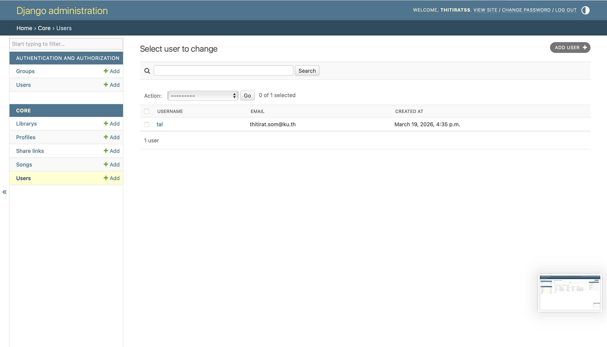
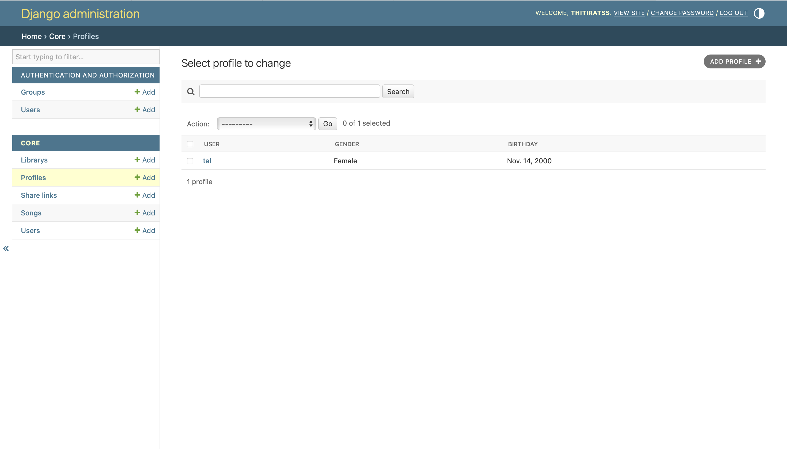
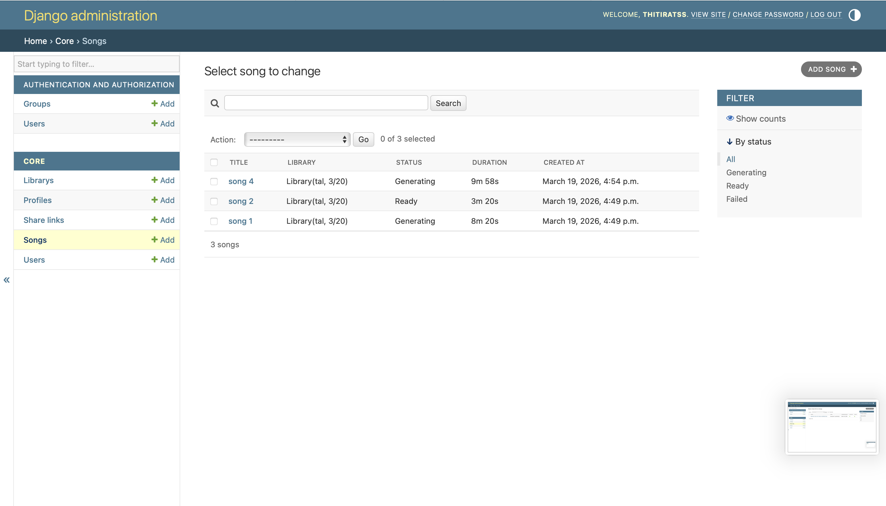
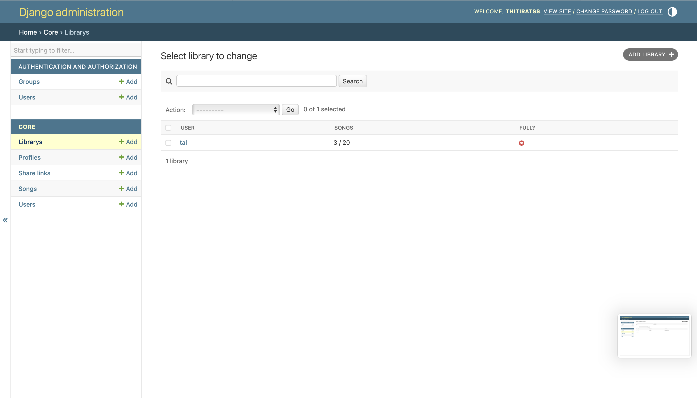
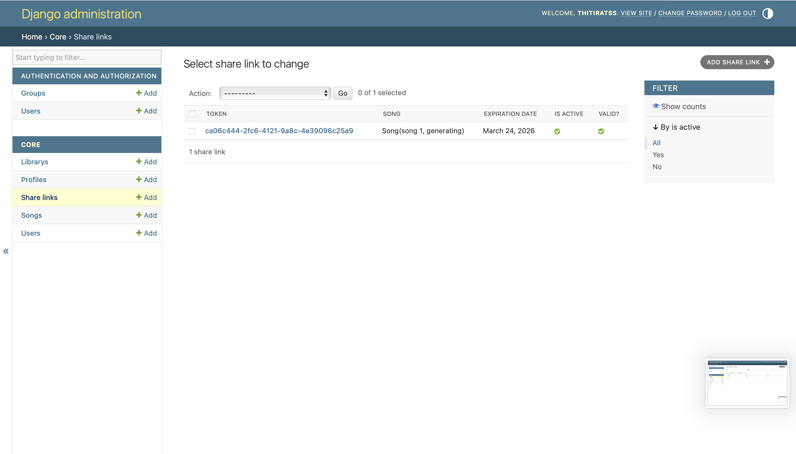

# EX3_SRS – Cithai AI Music Generator

Exercise project implemented with Django backend + React/Vite frontend.

## How to install

### 1. Clone the repository

```bash
git clone https://github.com/Thitirat-Somsupangsri/cithai.git
cd cithai
```

### 2. Create and activate a virtual environment

```bash
python3 -m venv .venv
source .venv/bin/activate
```

Windows:

```bash
.venv\Scripts\activate
```

### 3. Install backend dependencies

```bash
pip install -r requirements.txt
```

### 4. Install frontend dependencies

```bash
cd frontend
npm install
cd ..
```

### 5. Create your environment file

```bash
cp .env.example .env
```

Available environment variables:

```env
MUSIC_GENERATION_PROVIDER=mock
SUNO_API_URL=https://api.suno.example/api/v1/generate
SUNO_API_KEY=your_suno_api_key_here
SUNO_CALLBACK_URL=
BACKEND_PUBLIC_URL=https://your-public-url.example
NGROK_AUTHTOKEN=your_ngrok_authtoken
NGROK_URL=https://your-ngrok-url.ngrok-free.app
SUNO_MODEL=V4_5ALL
SUNO_CUSTOM_MODE=false
SUNO_INSTRUMENTAL=false
GOOGLE_OAUTH_CLIENT_ID=your_google_client_id
GOOGLE_OAUTH_CLIENT_SECRET=your_google_client_secret
GOOGLE_OAUTH_REDIRECT_URI=http://127.0.0.1:8000/auth/google/callback/
GOOGLE_OAUTH_AUTH_URI=https://accounts.google.com/o/oauth2/v2/auth
GOOGLE_OAUTH_TOKEN_URI=https://oauth2.googleapis.com/token
GOOGLE_OAUTH_USERINFO_URI=https://openidconnect.googleapis.com/v1/userinfo
GOOGLE_OAUTH_SCOPES=openid email profile
FRONTEND_APP_URL=http://127.0.0.1:5173
```

### 6. Set up Suno API secrets

If you want to run in `suno` mode:

1. Get a valid Suno API key from your Suno API provider account.
2. Put the key into `SUNO_API_KEY` in `.env`.
3. Set `SUNO_API_URL` to the Suno generate endpoint.
4. Set either `SUNO_CALLBACK_URL` directly, or set `BACKEND_PUBLIC_URL` and let the app build the callback automatically. The callback must point to:

```text
/integrations/suno/callback/
```

For local development, `localhost` is usually not reachable by Suno directly. You will usually need a public tunnel such as `ngrok` or another reverse-tunnel service.

#### ngrok: why it is needed

When `MUSIC_GENERATION_PROVIDER=suno`, the Suno provider must call back into your Django app at:

```text
/integrations/suno/callback/
```

That callback cannot be delivered to `localhost` or `127.0.0.1` from the public internet. `ngrok` gives your local Django server a temporary public HTTPS URL that forwards requests to port `8000` on your machine.

#### ngrok: install and connect your account

Install `ngrok` using the method for your platform, then sign in to your ngrok account and copy your auth token.

If you want to keep the token in `.env`, use:

```env
NGROK_AUTHTOKEN=your_ngrok_authtoken
```

Then register it with the CLI once:

```bash
ngrok config add-authtoken <your_ngrok_authtoken>
```

You can confirm the CLI is working with:

```bash
ngrok version
```

#### ngrok: start the tunnel

If `ngrok` is already installed:

```bash
ngrok http 8000
```

`ngrok` will print forwarding URLs similar to:

```text
Forwarding  https://abc123.ngrok-free.app -> http://localhost:8000
```

Use the `https://...ngrok-free.app` URL, not the `http://` one.

#### ngrok: wire the public URL into Django

Then copy the public HTTPS URL and set:

```env
BACKEND_PUBLIC_URL=https://your-public-url.example
```

With that value, Django automatically builds:

```text
https://your-public-url.example/integrations/suno/callback/
```

as the effective `SUNO_CALLBACK_URL`.

If you want to keep the ngrok values in `.env`, use:

```env
NGROK_AUTHTOKEN=your_ngrok_authtoken
NGROK_URL=https://your-ngrok-url.ngrok-free.app
BACKEND_PUBLIC_URL=https://your-ngrok-url.ngrok-free.app
```

or explicitly:

```env
SUNO_CALLBACK_URL=https://your-public-url.example/integrations/suno/callback/
```

Use explicit `SUNO_CALLBACK_URL` only if you need to override the automatically generated callback URL. In normal local development, setting only `BACKEND_PUBLIC_URL` is simpler.

#### ngrok: local development checklist

1. Start Django on port `8000`
2. Run `ngrok http 8000`
3. Copy the public `https://...` URL
4. Put that URL into `BACKEND_PUBLIC_URL`
5. Restart Django so the new env values are loaded
6. Trigger song generation

If you restart `ngrok`, the public URL usually changes unless you are using a reserved domain. When that happens, update `.env` and restart Django again.

Important:

- `SUNO_CALLBACK_URL` must be public and must end with `/integrations/suno/callback/`
- `localhost`, `127.0.0.1`, and placeholder example URLs will fail
- restart Django after changing `.env`
- if Suno never updates a song out of `generating`, first verify that `BACKEND_PUBLIC_URL` still matches the current ngrok URL

### 7. Set up Google OAuth

Put your Google OAuth client values into `.env`:

```env
GOOGLE_OAUTH_CLIENT_ID=your_google_client_id
GOOGLE_OAUTH_CLIENT_SECRET=your_google_client_secret
GOOGLE_OAUTH_REDIRECT_URI=http://127.0.0.1:8000/auth/google/callback/
FRONTEND_APP_URL=http://127.0.0.1:5173
```
#### Google OAuth: create credentials in Google Cloud Console

1. Open Google Cloud Console
2. Select or create a project
3. Go to `APIs & Services` -> `OAuth consent screen`
4. Configure the consent screen for testing or internal use
5. Add the scopes you need for this app:

```text
openid
email
profile
```

6. Go to `APIs & Services` -> `Credentials`
7. Create an `OAuth client ID`
8. Choose `Web application`
9. Add the frontend and backend URLs shown below
10. Copy the generated client ID and client secret into `.env`

Google Cloud Console values:

- Authorized JavaScript origins:

```text
http://127.0.0.1:5173
```

- Authorized redirect URIs:

```text
http://127.0.0.1:8000/auth/google/callback/
```

If you prefer `localhost` instead of `127.0.0.1`, keep it consistent. Mixing `localhost` and `127.0.0.1` across frontend, backend, and Google Console is a common source of OAuth redirect mismatches.

#### Google OAuth: recommended local `.env`

```env
GOOGLE_OAUTH_CLIENT_ID=your_google_client_id
GOOGLE_OAUTH_CLIENT_SECRET=your_google_client_secret
GOOGLE_OAUTH_REDIRECT_URI=http://127.0.0.1:8000/auth/google/callback/
FRONTEND_APP_URL=http://127.0.0.1:5173
GOOGLE_OAUTH_AUTH_URI=https://accounts.google.com/o/oauth2/v2/auth
GOOGLE_OAUTH_TOKEN_URI=https://oauth2.googleapis.com/token
GOOGLE_OAUTH_USERINFO_URI=https://openidconnect.googleapis.com/v1/userinfo
GOOGLE_OAUTH_SCOPES=openid email profile
```

#### Google OAuth: local run sequence

1. Start Django on `http://127.0.0.1:8000`
2. Start the frontend on `http://127.0.0.1:5173`
3. Open the frontend in the browser
4. Click the Google sign-in button
5. Complete the Google consent flow
6. Verify that the app returns you to the frontend and shows the logged-in user

#### Google OAuth: using a public backend URL

If you expose Django through a public domain or tunnel for OAuth testing, add that exact callback URL to Google Cloud Console too, for example:

```text
https://your-public-url.example/auth/google/callback/
```

and update:

```env
GOOGLE_OAUTH_REDIRECT_URI=https://your-public-url.example/auth/google/callback/
```

`FRONTEND_APP_URL` should still point to wherever your frontend is actually running.

#### Google OAuth: common failure cases

- `redirect_uri_mismatch`: the URL in Google Cloud Console does not exactly match `GOOGLE_OAUTH_REDIRECT_URI`
- `Google OAuth is not configured.`: one or more required env vars are missing, usually `GOOGLE_OAUTH_CLIENT_ID`, `GOOGLE_OAUTH_CLIENT_SECRET`, or `GOOGLE_OAUTH_REDIRECT_URI`
- login succeeds at Google but does not return to the app: check that Django is running on the same host/port used in `GOOGLE_OAUTH_REDIRECT_URI`
- frontend returns to the wrong address: check `FRONTEND_APP_URL`
- local Safari or host-switching issues: keep using either `127.0.0.1` everywhere or `localhost` everywhere for the same test run

### 8. Apply migrations

```bash
python3 manage.py migrate
```

### Share link expiration options

- `POST /users/{user_id}/songs/{song_id}/share-links/` accepts `expiration_option`
- allowed values are `7_days` and `1_month`
- if omitted, the backend defaults to `7_days`

### 9. Optional: create a superuser

```bash
python3 manage.py createsuperuser
```

## How to run

### Run with separated frontend and backend

Backend:

```bash
./venv/bin/python manage.py runserver
```

Frontend:

```bash
cd frontend
npm run dev
```

Open:

```text
http://127.0.0.1:5173/
```

Notes:

- Django API stays on `http://127.0.0.1:8000`
- React frontend runs on `http://127.0.0.1:5173`
- Vite proxies `/users`, `/share-links`, `/integrations`, and `/auth` to Django during development

### Run in Mock mode

Set this in `.env`:

```env
MUSIC_GENERATION_PROVIDER=mock
```

Then run:

```bash
python3 manage.py runserver
```

Behavior in this mode:

- Song generation finishes immediately.
- No external API key is required.
- Useful for demo and testing.

### Run in Suno mode

Set this in `.env`:

```env
MUSIC_GENERATION_PROVIDER=suno
SUNO_API_URL=https://api.sunoapi.org/api/v1/generate
SUNO_API_KEY=your_real_suno_api_key
BACKEND_PUBLIC_URL=https://your-public-url.example
SUNO_MODEL=V4_5ALL
SUNO_CUSTOM_MODE=false
SUNO_INSTRUMENTAL=false
```

Then run:

```bash
python3 manage.py runserver
```

Behavior in this mode:

- Creating a song starts an async generation task on Suno.
- The app stores Suno `taskId` in `provider_generation_id`.
- Suno sends the final result back to:

```text
POST /integrations/suno/callback/
```

- The callback updates the local song status to `ready` or `failed`.

Recommended local flow for Suno:

1. Start Django:

```bash
./venv/bin/python manage.py runserver
```

2. Start ngrok:

```bash
ngrok http 8000
```

3. Put the ngrok HTTPS URL into `BACKEND_PUBLIC_URL`

4. Restart Django

5. Start frontend:

```bash
cd frontend
npm run dev
```

6. Create a song from `http://127.0.0.1:5173`

### Google Login

The project supports Google OAuth login through:

- `GET /auth/google/login/`
- `GET /auth/google/callback/`

Frontend starts the flow from the login page and the backend redirects back to the frontend after a successful Google sign-in.

## Domain Model

The current domain model for the system is available as an exported diagram here:

- [domain_model.jpg](/Users/thitiratss/srs/ex3_srs/domain_model.jpg)

The diagram covers the main entities and relationships used in the project, including:

- `User` and `Profile`
- `Library` and `Song`
- `SongParameters`
- `ShareLink`
- enum types such as `SongStatus`, `Gender`, `Occasion`, `Genre`, and `VoiceType`

## Verify the project

Run tests:

```bash
python3 manage.py test core
```

## Example Run Output / Logs

- Mock generation evidence: [docs/evidence/mock-generation.md](/Users/thitiratss/srs/ex3_srs/docs/evidence/mock-generation.md:1)
- Suno generation evidence: [docs/evidence/suno-generation.md](/Users/thitiratss/srs/ex3_srs/docs/evidence/suno-generation.md:1)

## Notes

- Mock mode is the easiest way to verify the project end-to-end.
- Suno mode requires valid credentials and a reachable callback URL.
- Google OAuth requires a valid client ID/client secret and correctly configured redirect URI.
- The current app stores one local `Song` per Suno task. When Suno returns multiple generated tracks in the callback, the app currently uses the first returned track as the representative result for that local song.

## CRUD Evidence

[demo video](https://youtu.be/2D5Z9Am61D8)

Users:


Profiles:


Songs:


Libraries:


Share links:

